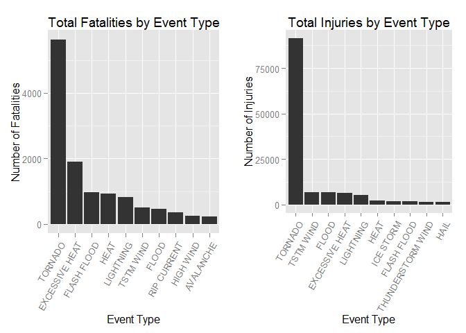
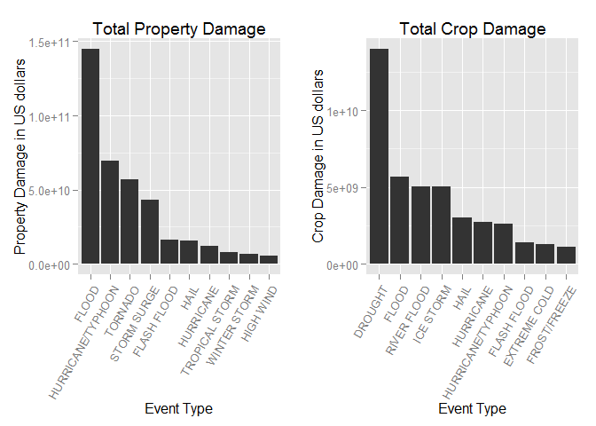

# Summary of Severe Weather Events on Population Health and Economy in the U.S.
qingcheng  
Thursday, August 21, 2014  

### Couresra-[Reproducible Research][repdata-005][Peer Assessment 2]

# A. Synopsis
In this data analysis document, we will consider two questions. 

> * Which types of severe weather events are most harmful with respect to **population health** across the United States? 
> * Which types of events have the greatest **economic consequences**?

The data we used come from the U.S. National Oceanic and Atmospheric Administration's (NOAA) storm database. This database tracks characteristics of major storms and weather events in the United States, including when and where they occur, as well as estimates of any fatalities, injuries, and property damage.

The data come in the form of a comma-separated-value file compressed via the bzip2 algorithm to reduce its size. The data can be downloaded from the course web site:

> * [Storm Data][1]

There is also two documentation of the database available:

> * [National Weather Service Storm Data Documentation][2]
> * [National Climatic Data Center Storm Events FAQ][3]

The events in the database start in the year 1950 and end in November 2011. In the earlier years of the database there are generally fewer events recorded, most likely due to a lack of good records. More recent years should be considered more complete.

From the analysis results, we can see that **tornado** is the most harmful with respect to **population health**, and **flood** and **drought** have the greatest economic consequences.


# B. Data Processing

### B.1. Locale and environment


```r
Sys.setlocale('LC_ALL', 'English')
```

```
## [1] "LC_COLLATE=English_United States.1252;LC_CTYPE=English_United States.1252;LC_MONETARY=English_United States.1252;LC_NUMERIC=C;LC_TIME=English_United States.1252"
```

```r
sessionInfo()
```

```
## R version 3.1.1 (2014-07-10)
## Platform: i386-w64-mingw32/i386 (32-bit)
## 
## locale:
## [1] LC_COLLATE=English_United States.1252 
## [2] LC_CTYPE=English_United States.1252   
## [3] LC_MONETARY=English_United States.1252
## [4] LC_NUMERIC=C                          
## [5] LC_TIME=English_United States.1252    
## 
## attached base packages:
## [1] stats     graphics  grDevices utils     datasets  methods   base     
## 
## loaded via a namespace (and not attached):
## [1] digest_0.6.4     evaluate_0.5.5   formatR_0.10     htmltools_0.2.4 
## [5] knitr_1.6        rmarkdown_0.2.49 stringr_0.6.2    tools_3.1.1     
## [9] yaml_2.1.13
```

### B.2. Download and read the dataset

```r
DataUrl<-"http://d396qusza40orc.cloudfront.net/repdata/data/StormData.csv.bz2"
filename = "StormData.csv.bz2"

download.file(DataUrl, destfile=filename)
dateDownloaded <- date()
dateDownloaded
```

```
## [1] "Fri Aug 22 16:49:55 2014"
```

```r
stormData <- read.csv(bzfile(filename))
```

### B.3. Cleaning the dataset
The size of the raw data loaded is quite big:

```r
print(object.size(stormData), units = "MB")
```

```
## 397.8 Mb
```

So we need to subset the data selecting only columns relevant to the analysis. First to see the summary of the raw data:

```r
str(stormData)
```

```
## 'data.frame':	902297 obs. of  37 variables:
##  $ STATE__   : num  1 1 1 1 1 1 1 1 1 1 ...
##  $ BGN_DATE  : Factor w/ 16335 levels "1/1/1966 0:00:00",..: 6523 6523 4242 11116 2224 2224 2260 383 3980 3980 ...
##  $ BGN_TIME  : Factor w/ 3608 levels "00:00:00 AM",..: 272 287 2705 1683 2584 3186 242 1683 3186 3186 ...
##  $ TIME_ZONE : Factor w/ 22 levels "ADT","AKS","AST",..: 7 7 7 7 7 7 7 7 7 7 ...
##  $ COUNTY    : num  97 3 57 89 43 77 9 123 125 57 ...
##  $ COUNTYNAME: Factor w/ 29601 levels "","5NM E OF MACKINAC BRIDGE TO PRESQUE ISLE LT MI",..: 13513 1873 4598 10592 4372 10094 1973 23873 24418 4598 ...
##  $ STATE     : Factor w/ 72 levels "AK","AL","AM",..: 2 2 2 2 2 2 2 2 2 2 ...
##  $ EVTYPE    : Factor w/ 985 levels "   HIGH SURF ADVISORY",..: 834 834 834 834 834 834 834 834 834 834 ...
##  $ BGN_RANGE : num  0 0 0 0 0 0 0 0 0 0 ...
##  $ BGN_AZI   : Factor w/ 35 levels "","  N"," NW",..: 1 1 1 1 1 1 1 1 1 1 ...
##  $ BGN_LOCATI: Factor w/ 54429 levels "","- 1 N Albion",..: 1 1 1 1 1 1 1 1 1 1 ...
##  $ END_DATE  : Factor w/ 6663 levels "","1/1/1993 0:00:00",..: 1 1 1 1 1 1 1 1 1 1 ...
##  $ END_TIME  : Factor w/ 3647 levels ""," 0900CST",..: 1 1 1 1 1 1 1 1 1 1 ...
##  $ COUNTY_END: num  0 0 0 0 0 0 0 0 0 0 ...
##  $ COUNTYENDN: logi  NA NA NA NA NA NA ...
##  $ END_RANGE : num  0 0 0 0 0 0 0 0 0 0 ...
##  $ END_AZI   : Factor w/ 24 levels "","E","ENE","ESE",..: 1 1 1 1 1 1 1 1 1 1 ...
##  $ END_LOCATI: Factor w/ 34506 levels "","- .5 NNW",..: 1 1 1 1 1 1 1 1 1 1 ...
##  $ LENGTH    : num  14 2 0.1 0 0 1.5 1.5 0 3.3 2.3 ...
##  $ WIDTH     : num  100 150 123 100 150 177 33 33 100 100 ...
##  $ F         : int  3 2 2 2 2 2 2 1 3 3 ...
##  $ MAG       : num  0 0 0 0 0 0 0 0 0 0 ...
##  $ FATALITIES: num  0 0 0 0 0 0 0 0 1 0 ...
##  $ INJURIES  : num  15 0 2 2 2 6 1 0 14 0 ...
##  $ PROPDMG   : num  25 2.5 25 2.5 2.5 2.5 2.5 2.5 25 25 ...
##  $ PROPDMGEXP: Factor w/ 19 levels "","-","?","+",..: 17 17 17 17 17 17 17 17 17 17 ...
##  $ CROPDMG   : num  0 0 0 0 0 0 0 0 0 0 ...
##  $ CROPDMGEXP: Factor w/ 9 levels "","?","0","2",..: 1 1 1 1 1 1 1 1 1 1 ...
##  $ WFO       : Factor w/ 542 levels ""," CI","$AC",..: 1 1 1 1 1 1 1 1 1 1 ...
##  $ STATEOFFIC: Factor w/ 250 levels "","ALABAMA, Central",..: 1 1 1 1 1 1 1 1 1 1 ...
##  $ ZONENAMES : Factor w/ 25112 levels "","                                                                                                                               "| __truncated__,..: 1 1 1 1 1 1 1 1 1 1 ...
##  $ LATITUDE  : num  3040 3042 3340 3458 3412 ...
##  $ LONGITUDE : num  8812 8755 8742 8626 8642 ...
##  $ LATITUDE_E: num  3051 0 0 0 0 ...
##  $ LONGITUDE_: num  8806 0 0 0 0 ...
##  $ REMARKS   : Factor w/ 436781 levels "","-2 at Deer Park\n",..: 1 1 1 1 1 1 1 1 1 1 ...
##  $ REFNUM    : num  1 2 3 4 5 6 7 8 9 10 ...
```
We can see that there are **902297** obsevations of **37** variables in the raw data. Only 8 variables relevant to this analysis, so we subset these variables in new data frame *data*:

```r
data <- stormData[, c("BGN_DATE", "EVTYPE", "FATALITIES", "INJURIES",
                      "PROPDMG", "PROPDMGEXP", "CROPDMG", "CROPDMGEXP")]
colnames(data) <- tolower(colnames(data))  #column names to lower case
rm(stormData)
```

We begin by creating a new variable *date* in the *data* by coercing the "BGN_DATE" variable into a Date format variable.

```r
data$date <- as.Date(data$bgn_date, format = "%m/%d/%Y")
mindate <- min(data$date)
maxdate <- max(data$date)
```
Therefore, the data was collected from **1950-01-03** to **2011-11-30**.

To study which type of weather events are most harmful with respect to **population health**, we can take a look at the number of **fatalities** and **injuries** caused by different types of weather events.

For question which type of weather events have the greatest **economic consequences**, we will compare the **property damage** and **crop damage** caused by different types of weather events. As mentioned in section 2.7 of [National Weather Service Storm Data Documentation][2], we need to convert the values of the columns `PROPDMG` and `CROPDMG` to unified number in dollars units, with the information in:

> * `PROPDMGEXP`: magnitude of the number value of property damage.
> * `PROPDMGEXP`: magnitude of the number value of crop damage.

Take a look at the `PROPDMGEXP` and `PROPDMGEXP`:

```r
#all event types to upper case and refactored
data$evtype <- factor(toupper(data$evtype))  
# all exponents defining unit of measurement of costs to upper case and refactored
data$propdmgexp <- factor(toupper(data$propdmgexp))
data$cropdmgexp <- factor(toupper(data$cropdmgexp))
levels(data$cropdmgexp)
```

```
## [1] ""  "?" "0" "2" "B" "K" "M"
```

```r
levels(data$propdmgexp)
```

```
##  [1] ""  "-" "?" "+" "0" "1" "2" "3" "4" "5" "6" "7" "8" "B" "H" "K" "M"
```
We just keep those records which have one of these values in these fields:

> * "" and "0": for one
> * "H": for hundreds
> * "K": for thousands
> * "M": for millions
> * "B": for billions


```r
# define multipliers for valid exponents
validExpo <- data.frame(c("", "0", "H", "K", "M", "B"), 
                             c(1, 1, 10^2, 10^3, 10^6, 10^9))
colnames(validExpo) <- c("validexp", "multiplier")

# subset data retaining only records with valid exponent
data <- subset(data, (cropdmgexp %in% validExpo$validexp) & (propdmgexp %in% 
    validExpo$validexp))
nrow(data) 
```

```
## [1] 902191
```

Compare with the origin number of obsevations **902297**, we know that the vast majority of records (**902191**) have a meaningful exponent. Then we convert the damage values to number in dollars units.

```r
colnames(validExpo) <- c("validexp", "propdmgmultiplier")
data <- merge(data, validExpo, by.x = "propdmgexp", by.y = "validexp")
data$propdmg <- (data$propdmg * data$propdmgmultiplier)

colnames(validExpo) <- c("validexp", "cropdmgmultiplier")
data <- merge(data, validExpo, by.x = "cropdmgexp", by.y = "validexp")
data$cropdmg <- (data$cropdmg * data$cropdmgmultiplier)
```


### B.4. The top 10 serious types of events on Population Health

After above data cleaning work, we will sort the data first then only take the 10 first most serious types of weather events to visualize and analyze. 

```r
library(plyr)
Fatalities <- aggregate(x = data$fatalities, by = list(data$evtype), FUN = sum)
names(Fatalities) <- c("evtype", "fatalities")
Fatalities <- arrange(Fatalities, fatalities, decreasing = TRUE)
Top10Fatalities <- head(Fatalities, n = 10)
Top10Fatalities <- within(Top10Fatalities, 
                          evtype <- factor(x = evtype, levels = Fatalities$evtype))

Injuries <- aggregate(x = data$injuries, by = list(data$evtype), FUN = sum)
names(Injuries) <- c("evtype", "injuries")
Injuries <- arrange(Injuries, injuries, decreasing = TRUE)
Top10Injuries <- head(Injuries, n = 10)
Top10Injuries <- within(Top10Injuries, 
                        evtype <- factor(x = evtype, levels = Top10Injuries$evtype))
```


### B.5. The top 10 serious types of events on Economic Consequences
Like the previous section, we only select top 10 serious types of events to visualize and analyze. 

```r
PropertyDmg <- aggregate(x = data$propdmg, by = list(data$evtype), FUN = sum)
names(PropertyDmg) <- c("evtype", "propdmg")
PropertyDmg <- arrange(PropertyDmg, propdmg, decreasing = TRUE)
Top10PropertyDmg <- head(PropertyDmg, n = 10)
Top10PropertyDmg <- within(Top10PropertyDmg, evtype <- 
                               factor(x = evtype, levels = Top10PropertyDmg$evtype))

CropDmg <- aggregate(x = data$cropdmg, by = list(data$evtype), FUN = sum)
names(CropDmg) <- c("evtype", "cropdmg")
CropDmg <- arrange(CropDmg, cropdmg, decreasing = TRUE)
Top10CropDmg <- head(CropDmg, n = 10)
Top10CropDmg <- within(Top10CropDmg, 
                       evtype <- factor(x = evtype, levels = Top10CropDmg$evtype))
```


# C. Results
After data processing above we can visualize our results.

### C.1. Population Health

Total **fatalities** of top 10 events

```r
Top10Fatalities
```

```
##            evtype fatalities
## 1         TORNADO       5633
## 2  EXCESSIVE HEAT       1903
## 3     FLASH FLOOD        978
## 4            HEAT        937
## 5       LIGHTNING        816
## 6       TSTM WIND        504
## 7           FLOOD        470
## 8     RIP CURRENT        368
## 9       HIGH WIND        246
## 10      AVALANCHE        224
```

Total **injuries** of top 10 events

```r
Top10Injuries
```

```
##               evtype injuries
## 1            TORNADO    91345
## 2          TSTM WIND     6957
## 3              FLOOD     6789
## 4     EXCESSIVE HEAT     6525
## 5          LIGHTNING     5230
## 6               HEAT     2100
## 7          ICE STORM     1975
## 8        FLASH FLOOD     1777
## 9  THUNDERSTORM WIND     1488
## 10              HAIL     1361
```


```r
library(ggplot2)
library(gridExtra)
```

```
## Loading required package: grid
```

```r
plot1 <- qplot(evtype, data = Top10Fatalities, weight = fatalities, geom = "bar", 
               binwidth = 1) + scale_y_continuous("Number of Fatalities") +
    theme(axis.text.x = element_text(angle = 60, hjust = 1)) + 
    xlab("Event Type") + ggtitle("Total Fatalities by Event Type")

plot2 <- qplot(evtype, data = Top10Injuries, weight = injuries, geom = "bar", 
               binwidth = 1) + scale_y_continuous("Number of Injuries") + 
    theme(axis.text.x = element_text(angle = 60, hjust = 1)) + 
    xlab("Event Type") + ggtitle("Total Injuries by Event Type")
grid.arrange(plot1, plot2, ncol = 2)
```

 

From the table and histograms above, we can see that the **tornado** is the most harmful with respect to **population health** across the United States.

### C.2. Economic Consequences

Total **Property Damage** of top 10 events

```r
Top10PropertyDmg
```

```
##               evtype   propdmg
## 1              FLOOD 1.447e+11
## 2  HURRICANE/TYPHOON 6.931e+10
## 3            TORNADO 5.694e+10
## 4        STORM SURGE 4.332e+10
## 5        FLASH FLOOD 1.614e+10
## 6               HAIL 1.573e+10
## 7          HURRICANE 1.187e+10
## 8     TROPICAL STORM 7.704e+09
## 9       WINTER STORM 6.688e+09
## 10         HIGH WIND 5.270e+09
```

Total **Crop Damage** of top 10 events

```r
Top10CropDmg
```

```
##               evtype   cropdmg
## 1            DROUGHT 1.397e+10
## 2              FLOOD 5.662e+09
## 3        RIVER FLOOD 5.029e+09
## 4          ICE STORM 5.022e+09
## 5               HAIL 3.001e+09
## 6          HURRICANE 2.742e+09
## 7  HURRICANE/TYPHOON 2.608e+09
## 8        FLASH FLOOD 1.421e+09
## 9       EXTREME COLD 1.313e+09
## 10      FROST/FREEZE 1.094e+09
```


```r
plot3 <- qplot(evtype, data = Top10PropertyDmg, weight = propdmg, geom = "bar", 
               binwidth = 1) + 
    theme(axis.text.x = element_text(angle = 60, hjust = 1)) + 
    ylab("Property Damage in US dollars") + 
    xlab("Event Type") + ggtitle("Total Property Damage")

plot4 <- qplot(evtype, data = Top10CropDmg, weight = cropdmg, geom = "bar", 
               binwidth = 1) + 
    theme(axis.text.x = element_text(angle = 60, hjust = 1)) + 
    ylab("Crop Damage in US dollars") + 
    xlab("Event Type") + ggtitle("Total Crop Damage")
grid.arrange(plot3, plot4, ncol = 2)
```

 

As shown in the table and figure above, **flood** has the greatest property damage, and **drought** has the most serious impact on crop damage. 


[1]:https://d396qusza40orc.cloudfront.net/repdata%2Fdata%2FStormData.csv.bz2
[2]:https://d396qusza40orc.cloudfront.net/repdata%2Fpeer2_doc%2Fpd01016005curr.pdf
[3]:https://d396qusza40orc.cloudfront.net/repdata%2Fpeer2_doc%2FNCDC%20Storm%20Events-FAQ%20Page.pdf

